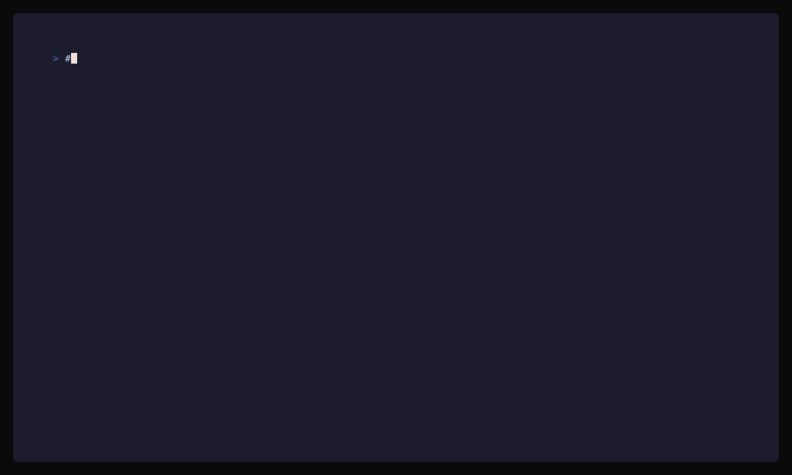

# llm-lint

[](https://github.com/JadenRazo/llm-lint/actions/workflows/ci.yml)
[](https://github.com/JadenRazo/llm-lint/releases)
[](https://www.npmjs.com/package/@jadenrazo/llm-lint)
[](https://www.npmjs.com/package/@jadenrazo/llm-lint)
[](LICENSE)

A SonarQube/gitleaks-style scanner that catches **LLM artifacts** before they ship to production: `CLAUDE.md`, `.claude/`, `Co-authored-by: Claude` commit trailers, `.cursorrules`, GitHub Copilot config, AI refusal text leaked into source, and more.



For every finding, `llm-lint` tells you **what** it found, **where**, **why it matters**, and **exactly how to prevent it from happening again** (e.g., for Claude trailers: edit `~/.claude/settings.json` and set `"includeCoAuthoredBy": false`).

```
✗ LLM003  error    Co-authored-by: Claude trailer
   └─ commit ab12cd3 "feat: add user search" (Alice <alice@corp>)
      To prevent this on future commits, edit your local Claude Code settings:

          # ~/.claude/settings.json
          { "includeCoAuthoredBy": false }
```

## What it catches

| ID | Severity | Detects |
|---|---|---|
| `LLM001` | error | `CLAUDE.md` committed at any depth |
| `LLM002` | error | `.claude/` directory tracked in git |
| `LLM003` | error | `Co-authored-by: Claude` commit trailer |
| `LLM004` | warning | `🤖 Generated with [Claude Code]` / `Generated with Claude` in commit messages |
| `LLM005` | warning | `CLAUDE_NOTES.md`, `CLAUDE_*.md`, `.claude.local.md` |
| `LLM006` | error | `.cursorrules`, `.cursor/`, `.cursorignore` |
| `LLM007` | warning | `.github/copilot-instructions.md`, `.copilotignore`, `.github/copilot/` |
| `LLM008` | warning | `.aider*` (config, history, input log) |
| `LLM009` | warning | `.continue/`, `.continuerc.json` |
| `LLM010` | warning | `.codeium/`, `codeium.toml` |
| `LLM011` | warning | `.windsurfrules`, `.windsurf/` |
| `LLM012` | warning | `Co-authored-by: <Copilot/OpenAI/Cursor/Codeium/Aider>` trailers |
| `LLM013` | info | LLM refusal/boilerplate strings in source ("As an AI language model…", "I'm sorry, but I can't…") |
| `LLM014` | info | "Generated by ChatGPT/GPT-4/Claude/Copilot" markers in comments |
| `LLM015` | info | `.mcp.json` referencing claude-code MCP servers |

Run `llm-lint rules show LLM003` for the full description and remediation of any rule.

## Quick start

**Run it once, no install:**

```bash
npx @jadenrazo/llm-lint scan
```

That's the entire setup. Requires Node 18+; works on Linux, macOS (Intel + Apple Silicon), and Windows.

The npm package ships native Go binaries via the [esbuild-style optionalDependencies pattern](https://github.com/evanw/esbuild/tree/main/npm) — npm pulls only the binary matching your platform (~3 MB), with no postinstall scripts and no Node runtime dependency once installed.

<details>
<summary><b>Other install methods</b></summary>

```bash
# Persistent install via npm
npm install -g @jadenrazo/llm-lint
llm-lint scan

# Native binary, no Node (Linux/macOS, AMD64/ARM64)
arch=$(uname -m); [ "$arch" = aarch64 ] && arch=arm64
curl -sSfL "https://github.com/JadenRazo/llm-lint/releases/latest/download/llm-lint_$(uname -s)_${arch}.tar.gz" \
  | sudo tar -xz -C /usr/local/bin llm-lint
llm-lint scan

# Docker
docker run --rm -v "$PWD":/workspace ghcr.io/jadenrazo/llm-lint:latest scan

# Homebrew, apt, yum — see https://github.com/JadenRazo/llm-lint/releases
```

</details>

Exit codes:

- `0` — no findings at or above `--fail-on` severity (default `error`)
- `1` — findings exceeded threshold
- `2` — internal error (bad config, IO, etc.)

## Auto-fix

For deterministic cleanup, run:

```bash
llm-lint scan --fix
```

Auto-fix removes matching LLM boilerplate/comment-marker lines, appends safe ignore patterns to `.gitignore`, untracks local AI/tool files with `git rm --cached` while keeping them in your working tree, and strips AI trailers/markers from the latest commit message.

Preview the same plan without changing files, the git index, or history:

```bash
llm-lint scan --fix-preview
```

Commit-message cleanup is configurable:

```bash
llm-lint scan --fix-preview --fix-git-history scanned # preview broad history cleanup
llm-lint scan --fix --fix-git-history latest   # default: only HEAD
llm-lint scan --fix --fix-git-history scanned  # rewrite all matching scanned commits on HEAD history
llm-lint scan --fix --fix-git-history none     # leave commit findings as manual
```

Use `scanned` when you intentionally want to scrub all matching AI traces from the scanned history. This rewrites commit IDs for cleaned commits and their descendants, and rewritten commits will not retain commit signatures, so coordinate before using it on shared branches.

## CI integration

### GitHub Actions (recommended: native annotations)

In CI, `--format github` emits inline PR annotations and a Markdown step summary. It auto-activates when `GITHUB_ACTIONS=true` is set and `--format` is not explicitly chosen — so this just works:

```yaml
- run: llm-lint scan --fail-on error
```

For inline PR review comments and a sticky PR comment with the findings:

```yaml
- run: llm-lint scan --fail-on error --pr-comment
  env:
    GITHUB_TOKEN: ${{ secrets.GITHUB_TOKEN }}
```

The sticky comment edits in place across runs (one comment per PR, not N). PR comment failures never fail the build — they're logged to stderr and skipped.

Use `--format sarif` instead when you want findings to land in GitHub Code Scanning alerts:

### GitHub Actions (legacy: SARIF upload)

Drop this into `.github/workflows/llm-lint.yml`. Findings flow into the **Code Scanning** tab via SARIF. Node is preinstalled on `ubuntu-latest`, so `npx` is the shortest path:

```yaml
name: llm-lint
on:
  pull_request:
  push:
    branches: [main, master]
permissions:
  contents: read
  security-events: write
jobs:
  scan:
    runs-on: ubuntu-latest
    steps:
      - uses: actions/checkout@v4
        with: { fetch-depth: 0 }     # full history; required for trailer rules
      - run: npx -y @jadenrazo/llm-lint@latest scan --format sarif --output llm-lint.sarif --fail-on error
      - uses: github/codeql-action/upload-sarif@v3
        if: always()
        with: { sarif_file: llm-lint.sarif }
```

Pin a specific version (`@jadenrazo/llm-lint@0.2.1`) for reproducible runs.

### GitLab CI

```yaml
llm-lint:
  stage: test
  image: ghcr.io/jadenrazo/llm-lint:latest
  variables:
    GIT_DEPTH: "0"
  script:
    - llm-lint scan --format json --output llm-lint.json --fail-on error
  artifacts:
    when: always
    paths: [llm-lint.json]
```

### pre-commit

The fastest path is to let llm-lint write the hook for you:

```bash
llm-lint hook install
```

This autodetects: if you already have `.pre-commit-config.yaml`, it adds an entry there; otherwise it writes a managed shell hook to `.git/hooks/pre-commit`. Either way, commits are gated on `llm-lint scan --staged-only`, which scans the git index — typically <100ms even on large repos. Run `llm-lint hook status` to inspect, `llm-lint hook uninstall` to remove.

If you prefer to manage `.pre-commit-config.yaml` yourself:

```yaml
# .pre-commit-config.yaml
repos:
  - repo: https://github.com/JadenRazo/llm-lint
    rev: v0.2.3
    hooks:
      - id: llm-lint
```

The pre-commit hook runs in `--staged-only` mode, so only path/content rules fire on staged blobs. Trailer/message rules require an actual commit and are skipped (they apply at scan-time, not pre-commit-time).

### Docker

```bash
docker run --rm -v "$PWD":/workspace ghcr.io/jadenrazo/llm-lint:latest scan
```

## Baselining existing findings

Adopting llm-lint on a repo with historical artifacts is painful if CI fails on day one. The baseline file accepts current findings without losing visibility — they're still reported, marked `(baselined)`, but excluded from the `--fail-on` exit-code gate.

```bash
llm-lint baseline create        # snapshots .llmlint-baseline.yaml from current findings
git add .llmlint-baseline.yaml  # commit it; the file is meant to be in version control
```

After this, `llm-lint scan` ignores baselined findings for CI gating but still flags anything new. As the team fixes baselined findings:

```bash
llm-lint baseline status        # see how many are baselined / new / stale
llm-lint baseline prune         # drop entries that no longer match any finding
llm-lint baseline update        # re-snapshot (alias for `create --force`)
```

The goal is to shrink the baseline toward zero. Stale entries (an entry whose finding has been fixed) print a warning by default; set `baseline.stale_action: fail` in `.llmlint.yaml` to enforce cleanup in CI.

Fingerprints are stable across line shifts (for content findings) and severity changes (severity is config, not finding identity). Path renames invalidate path findings — that's intentional, since a rename is a deliberate change. SARIF output emits `baselineState: unchanged` for baselined findings, so GitHub Code Scanning treats them as suppressed-from-PR-summary natively.

## Configuration

Drop a `.llmlint.yaml` at your repo root. Every key is optional — defaults work for most projects.

```yaml
version: 1

# Filter to specific categories. Omit for "all".
categories:
  - claude
  - cursor
  - copilot

# Per-rule overrides
rules:
  LLM013:
    severity: warning   # bump info → warning
  LLM004:
    enabled: false      # don't care about Claude attribution comments

# Paths to ignore (gitignore-style globs)
ignore:
  - "vendor/**"
  - "node_modules/**"
  - "**/*.min.js"
  - "testdata/**"

# Scan modes
scan:
  filesystem: true
  git_history: true
  git_history_depth: 1000   # 0 = full history

# Auto-fix policy used when `llm-lint scan --fix` runs
fix:
  git_history: latest        # none | latest | scanned

fail_on: error              # error | warning | info | none
```

A more annotated example lives in [`examples/.llmlint.yaml`](examples/.llmlint.yaml).

## CLI

```
llm-lint scan [path]              # scan dir (default ".")
llm-lint scan --format sarif --output llm-lint.sarif
llm-lint scan --fail-on warning
llm-lint scan --no-git            # skip history scan
llm-lint scan --since v1.0.0      # only commits newer than this ref
llm-lint scan --staged-only       # scan the git index (pre-commit hook mode)
llm-lint scan --fix-preview       # preview autofix changes without writing
llm-lint scan --fix --fix-git-history scanned
llm-lint scan --include LLM015 --exclude LLM004
llm-lint rules                    # list all rules with severity + category
llm-lint rules show LLM003        # full description + remediation
llm-lint hook install             # wire up a pre-commit hook (autodetect mode)
llm-lint hook status              # show current hook installation state
llm-lint hook uninstall           # remove the managed hook
llm-lint baseline create          # snapshot current findings into .llmlint-baseline.yaml
llm-lint baseline status          # show matched / new / stale counts
llm-lint baseline prune           # drop stale baseline entries
llm-lint version
```

## FAQ

**Why not just `.gitignore`?**
`.gitignore` is opt-in per developer and can't catch artifacts already committed before someone added the entry. `llm-lint` enforces at CI, so a missed `.gitignore` entry on one machine doesn't leak.

**How do I stop Claude from adding `Co-authored-by`?**
Edit `~/.claude/settings.json`:
```json
{ "includeCoAuthoredBy": false }
```
Or run `claude config set includeCoAuthoredBy false`. Recent Claude Code versions also gate the `🤖 Generated with [Claude Code]` message footer behind the same flag.

**Does it slow down CI?**
Typical scan is well under a second on 10k files. Filesystem walks run concurrently; git-history rules iterate commits in-process via `go-git` (no shell-out).

**Does it work on shallow clones?**
Yes — but commit-trailer rules need history. On `actions/checkout` use `fetch-depth: 0`. On a shallow clone, `llm-lint` still runs path/content rules and prints a note that history scanning was partial.

**My repo legitimately mentions `CLAUDE.md` in docs/tests — how do I avoid false positives?**
Add the path or pattern to your `.llmlint.yaml` `ignore` list, and/or disable noisy info-level rules (`LLM013`, `LLM014`) for repos that intentionally include LLM strings.

**Can I auto-fix?**
Not yet. We flag and teach; we don't rewrite. Auto-fix (`--fix` mode that adds `.gitignore` entries and runs `git rm --cached`) is on the roadmap; track [issues](https://github.com/JadenRazo/llm-lint/issues) for progress.

**Why is the npm package scoped (`@jadenrazo/llm-lint`)?**
The bare `llm-lint` name on npm is squatted by an unrelated project. Scoping under `@jadenrazo` keeps the name unambiguous and the publish path uncomplicated.

## Contributing

Adding a new rule is cheap:

1. Pick the next free `LLM###` ID (run `llm-lint rules` to see the current set).
2. Copy the closest existing rule struct in `internal/rules/builtin/{path,content,git_trailer}_rules.go`.
3. Write `Description` and `Remediation` strings — the latter must be concrete and actionable (commands, file paths, settings keys).
4. Add a fixture under `testdata/` and a table-driven test in the matching `_test.go`.
5. `go test ./...` — must be green before opening a PR.

Architecture overview:

```
cmd/llm-lint/  →  internal/engine/  →  internal/scanner/    (filesystem walk + path/content rules)
                                  ↳   internal/gitscan/     (commit history + trailer/message rules)
                                  ↳   internal/report/      (human / json / sarif)
internal/rules/   — rule definitions, registered via init()
internal/config/  — .llmlint.yaml schema + override resolution
```

## License

Apache-2.0. See [LICENSE](LICENSE).
